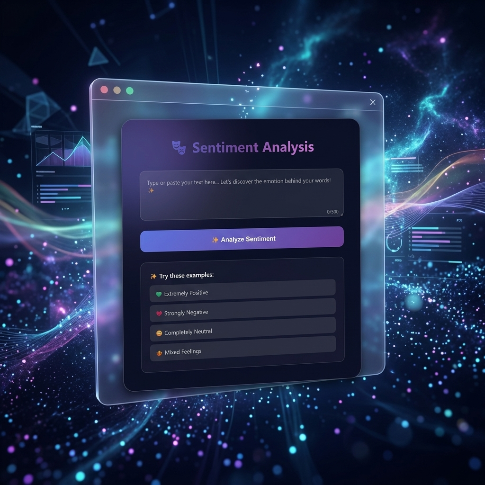
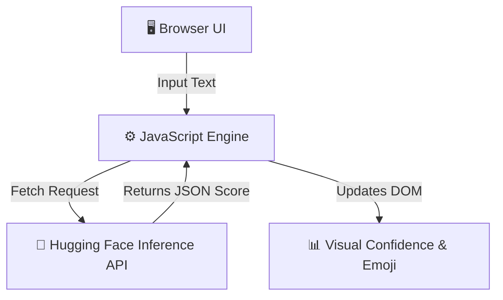

<div align="center">
  
  <h1>✨ Sentiment Analysis Tool ✨</h1>
  <p>A sleek, interactive frontend interface that analyzes the sentiment of any text in real-time using cutting-edge Hugging Face AI Models.</p>

  <!-- Badges -->
  <p>
    
    
    
    
  </p>
</div>

---

## 🌟 Overview

Welcome to the **Sentiment Analysis Tool**. This mini-project showcases a highly interactive, animated, and immersive dark-mode user interface designed to analyze the emotional intent behind text. By seamlessly integrating the **Hugging Face DistilBERT inference API**, it calculates confidence scores and provides an emotional polarity (Positive, Neutral, Negative) instantly.

## 🚀 Key Features

* **Real-time AI Inference:** Directly queries the Hugging Face API for accurate, context-aware NLP sentiment analysis.
* **Fallback Local Analysis:** Employs a robust, keyword-based local sentiment fallback mechanism if the API is unreachable.
* **Animated Particle UI:** Features a stunning visual experience with floating CSS particles, glassmorphism, and neon gradients.
* **Dynamic Confidence Bars:** Visually represents the AI's confidence score vividly using color-coded progress bars and expressive emojis.

---

## 🛠️ Technology Stack

Built effortlessly with pure web fundamentals and powered by state-of-the-art AI.

* **Frontend:** HTML5, CSS3, Vanilla JavaScript (ES6+)
* **Machine Learning API:** Hugging Face `distilbert-base-uncased-finetuned-sst-2-english`
* **Animations:** Pure CSS Keyframes & JavaScript DOM manipulation

---

## 🏗️ System Architecture



---

## 🚦 Getting Started

### Prerequisites
No Node.js or complex building required!
* Any modern web browser (Chrome, Firefox, Safari, Edge)

### Setup & Run

Simply open the file in your browser:
```bash
# Clone the repository
git clone https://github.com/shreyas-bhandari/AIML-mini--project.git

# Navigate to the folder
cd AIML-mini--project

# Open the index.html file in your default browser (macOS/Linux)
open index.html

# (Windows)
start index.html
```
> **Note:** The API uses a free tier Hugging Face endpoint. If it takes a few seconds on the first try, the model is simply spinning up!

---

<div align="center">
  <b>Engineered with ❤️ to explore the intersection of beautiful UI and Artificial Intelligence.</b>
</div>
